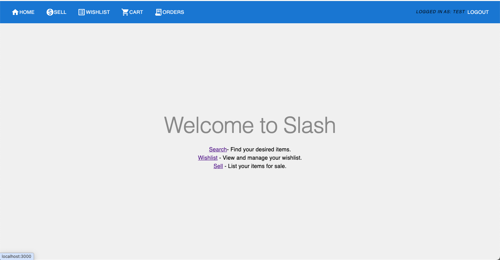

<a href="https://github.com/SE-Fall-2024-Team-52/slash-ui/issues">
<a href="https://github.com/SE-Fall-2024-Team-52/slash-ui/pulls">

## Demo

## Motivation

* ***Students***: Students coming to university are generally on a budget and time constraint and generally spend hours wasting time to search for products on Websites. Slash is the perfect tool for these students that slashes all the unnecessary details on a website and helps them get prices for a product across multiple websites.Make the most of this tool in the upcoming Black Friday Sale.
* ***Data Analysts***: Finding data for any project is one of the most tedious job for a data analyst, and the datasets found might not be the most recent one. Using slash, they can create their own dataset in real time and format it as per their needs so that they can focus on what is actually inportant.

## Why

* In a market where we are spoilt for choices, we often look for the best deals.
* The ubiquity of internet access has leveled the retail playing field, making it easy for individuals and businesses to sell products without geographic limitation. In 2020, U.S. e-commerce sales, receiving a boost due to the COVID-19 pandemic, grew 44% and represented more than 21% of total retail sales, according to e-commerce information source Internet Retailer.
* The growth of e-commerce has not only changed the way customers shop, but also their expectations of how brands approach customer service, personalize communications, and provide customers choices.
* E-commerce market has prompted cut throat competition amongst dealers, which is discernable through the price patterns for products of major market players. Price cuts are somewhat of a norm now and getting the best deal for your money can sometimes be a hassle (even while online shopping).
* This is what Slash aims to reduce by giving you an easy to use, all in one place solution for finding the best deals for your products that major market dealers have to offer!
* Slash in its current form is for students who wish to get the best deals out of every e-commerce site and can be used by anyone who is willing to develop an application that consumes these web APIs.
* Future scope includes anything from a web application with a frontend or any Android or IOS application that utilises these Web APIs at their backend. Anyone can build their own custom application on top of these web APIs.

## What is Slash?

Do you love shopping? Are you in search of some good deals while shopping online?! Slash is here to help you look for the best deals!

Slash is a publicly accessible web API framework that allows one to scrape the most popular e-commerce websites to get the best deals on the searched items across multiple e-commerce websites. Currently supported websites include [Walmart](https://www.walmart.com/) and [EBay](https://www.ebay.com/).

* **Fast**: With slash, you can save over 50% of your time by comparing deals across websites within seconds
* **Easy**: Slash introduces easy to use public APIs to filter, sort and search through the search results
* **Powerful**: Produces JSON responses that can be easily customised to bring about the desired output

This is the Home Page of the website.

## Tools and Technology Used

### Tools

1. Visual Studio Code
2. Github

### Technology

1. Node.js
2. React.js

## Installation

To get a local copy up and running, follow the instructions in the [Installation Guide](INSTALL.md)

## Contributing

We welcome contributions from everyone! If you'd like to contribute, please read the [Contributing Guidelines](CONTRIBUTING.md) for details on the code style, testing procedures, and submission process.

## Code of Conduct

This project adheres to a [Code of Conduct](CODE-OF-CONDUCT.md) to promote a welcoming environment for everyone. Please take a moment to review it.

## Application Guide

Refer to the application Guide for using the application [Application Guide](Application_Guide.md)

## License

Slash is licensed under the MIT License. See the [LICENSE](LICENSE.md) file for more details.

---

Thank you for your interest in **Slash**! If you have any questions, feel free to reach out to the maintainers.

## Contact US

EMAIL: <cse510se.project@gmail.com>
